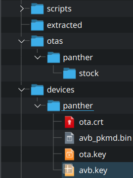

# avbroot-utils

A collection of utilities for [avbroot].

Before executing any of the commands below, please [generate AVB keys]. Then put ota.crt, avb_pkmd.bin, ota.key, avb.key into a folder named `devices/${DEVICE_NAME}`, where `${DEVICE_NAME}` is the name of your device (used in `--target ${DEVICE_NAME}` in one of the options below).

If you intend to use Magisk, please follow [Magisk preinit device guide] and edit the preinit device (`${PREINIT_DEVICE}`) that is used in option 2 and option 3.



## Option 1: `make_normal_ota.sh`

Create and sign an OTA without any modifications.

Example usage:
```
./scripts/make_custom_kernel_ota.sh \
    --target ${DEVICE_NAME} \
    --output-dir ./otas/${DEVICE_NAME}/stock \
    --original-ota ~/Downloads/ota.zip
```

## Option 2: `make_custom_kernel_ota.sh`

Create and sign an OTA with custom kernel and Magisk.

Example usage:
```
./scripts/make_custom_kernel_ota.sh \
    --target ${DEVICE_NAME} \
    --output-dir ./otas/${DEVICE_NAME}/magisk \
    --kernel-zip ~/Downloads/kernel.zip \
    --original-ota ~/Downloads/ota.zip \
    --magisk-apk ~/Downloads/app-release.apk \
    --magisk-preinit-device ${PREINIT_DEVICE}
```

## Option 3: `make_magisk_ota.sh`

Create and sign an OTA with Magisk using stock kernel.

Example usage:
```
./scripts/make_magisk_ota.sh \
    --target ${DEVICE_NAME} \
    --output-dir ./otas/${DEVICE_NAME}/stock \
    --original-ota ~/Downloads/ota.zip \
    --magisk-apk ~/Downloads/app-release.apk \
    --magisk-preinit-device ${PREINIT_DEVICE}
```

## Finally: Do the initial setup in order

- `extract_patched.sh` (step 3 of the avbroot initial setup).
- `flash_extracted_ota.sh` (step 4 of the avbroot initial setup). This step is important as there are safeguards in place to protect you from accidentally brick your device due to anti-rollback protection (ARP) etc.
- `setup_custom_avb_public_key.sh` (step 5 of the avbroot initial setup).

Follows [avbroot initial setup] for further usage.

Subsequent OTAs does not need this step, as you can rerun option 1/2/3 of this guide and use `adb sideload` to flash the patched OTA.

[avbroot]: https://github.com/chenxiaolong/avbroot
[generate AVB keys]: https://github.com/chenxiaolong/avbroot#generating-keys
[Magisk preinit device guide]: https://github.com/chenxiaolong/avbroot#magisk-preinit-device
[avbroot initial setup]: https://github.com/chenxiaolong/avbroot#initial-setup

